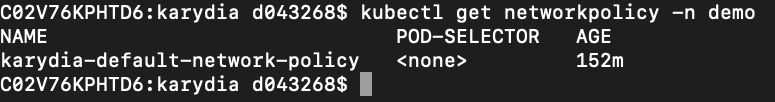

# Karydia - Kubernetes security walnut


Status: beta

Karydia is a security add-on to Kubernetes to help with good security practices by inverting insecure Kubernetes defaults. Kubernetes defaults are not focused on security but on running out of the box without complicated upfront configuration. It is easy to get a pod up and running. In the simplest case it is just one command. But of course, with such a simple setup you cannot expect a highly secure application. Defaults are not enough! 

Karydia inverts the following insecure defaults:
* Unmount service account token
* Restrict system calls by adding a seccomp profile
* Run with minimal privileges by adding a none root user
* Restrict network communication by adding a network policy to each namespace 

Karydia is implemented as [webhook admission
controller](https://kubernetes.io/docs/reference/access-authn-authz/extensible-admission-controllers/)
and configurable through a custom Kubernetes resource.


## Installing Karydia
Karydia can be [installed](install/README.md) via a helm chart.

## Demo
### Invert pod defaults
The following screen shot shows the pod specification without the usage of Karydia:
* service accout token is mounted
* a user is not specified (so root will be taken)
* no seccomp profile is assigned
```
kubectl run -it --rm --restart=Never alpine --image=alpine sh -n demo
kubectl edit  pod/alpine -n demo
```


If a pod was created after the installation of Karydia the pod description will be different, even so it was the same call:
* no service account token is mounted 
* a user is specified (root user will not be used)
* seccomp profile runtime/default is assigned

```
kubectl run -it --rm --restart=Never alpine --image=alpine sh -n demo
kubectl edit  pod/alpine -n demo
```


### Add network policy
Karydia adds a default networkpolicy to each namespace and reconciles it. 
```
kubectl get networkpolicy -n demo
```


## Features and configuration options
Each feature can be configured to application specific needs:
* custom seccomp profile
* custom default network policy
* specific network policy per namespace
* usage of root user if necessary

See all [features and options](docs/features.md).

## Testing

### Integration Tests

##### Install Karydia Dev
```
kubectl apply -f ./install/helm-service-account.yaml
helm init --service-account tiller
helm install ./install/charts --name karydia --set dev.active=true
```

##### Build, Swap and Test

```
make build deploy-dev
make e2e-test
```

### Unit Tests

```
make test
```

### Debug Karydia

To be able to debug (e.g. Visual Studio Code), change the following line in the Debug configuration:

```
"args": ["--kubeconfig","<PATH>/.kube/config"]
```
