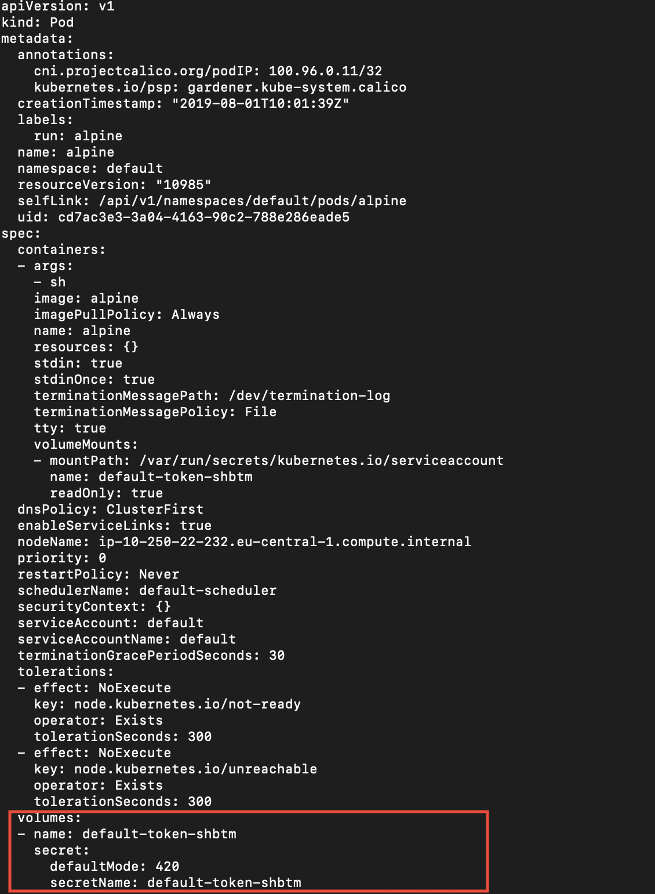
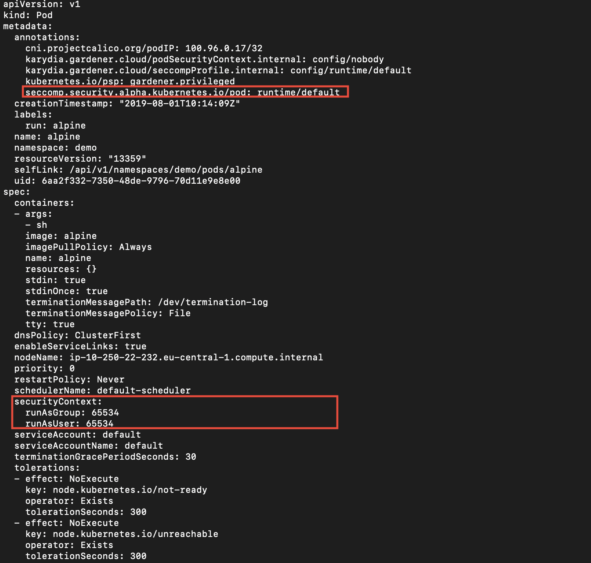

# karydia - Kubernetes security walnut


Status: beta

karydia is a security add-on to Kubernetes to help with good security practices by inverting insecure Kubernetes defaults. 
Karydia is an open-source product that helps you to get a secure-by-default application running on Kubernetes with minimal additional effort. 

karydia is implemented as[webhook admission
controller](https://kubernetes.io/docs/reference/access-authn-authz/extensible-admission-controllers/)
and configurable through a custom Kubernetes resources.


Kubernetes defaults are not focused on security but on running out of the box without complicated upfront configuration. It is really easy to get a pod up and running. In the simplest case it is just one command. But of course with such a simple setup you cannot expect a highly secure application. Defaults are not enough! 

Karydia inverts the following insecure defaults:
* Unmount service account token
* Restrict system calls by adding a seccomp profile
* Run with minimal privileges by adding a none root user
* Restrict network communication by adding a network policy to each namespace


## Installing karydia
Karydia can be installed via a helm chart. [installing karydia](install/README.md).

## Demo
The following screen shots will show you the pod desription without the usage of Karydia. You can see that a service accout token is mounted, a user is not specified (so root will be taken) and no seccomp profile is assigned. 
```
kubectl run -it --rm --restart=Never alpine --image=alpine sh -n demo
kubectl edit  pod/alpine -n demo
```


After you have installed Karydia you will get the following pod description, even so it was the same call. Now the pod has a user specified, the service account token is not mounted and the seccomp profile runtime/default is assigned.

```
kubectl run -it --rm --restart=Never alpine --image=alpine sh -n demo
kubectl edit  pod/alpine -n demo
```


## Features and configuration options

See [features](docs/features.md).

## Testing

### Integration Tests

##### Install Karydia Dev
```
kubectl apply -f ./install/helm-service-account.yaml
helm init --service-account tiller
helm install ./install/charts --name karydia --set dev.active=true
```

##### Build, Swap and Test

```
make build deploy-dev
make e2e-test
```

### Unit Tests

```
make test
```

### Debug Karydia

To be able to debug (e.g. Visual Studio Code), change the following line in the Debug configuration:

```
"args": ["--kubeconfig","<PATH>/.kube/config"]
```

