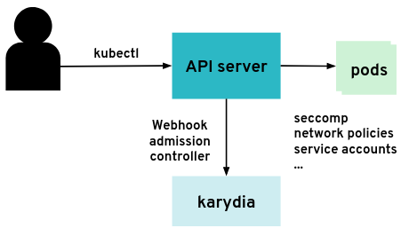

# karydia - Kubernetes security walnut


Status: alpha, work in progress

karydia is a security add-on to Kubernetes to help with good security practices
and assist administrators in keeping their clusters safe. karydia is implemented as
[webhook admission
controller](https://kubernetes.io/docs/reference/access-authn-authz/extensible-admission-controllers/)
and configurable through its command line interface and Kubernetes resources.

While it has been written with [Gardener](https://gardener.cloud/) in mind, it
can be used on any Kubernetes cluster.



## Installing karydia

See [installing karydia](install/README.md).

## Demo

Please see [demo](docs/demos/seccomp.md) for a demo of the seccomp feature of karydia.

## Features and configuration options

See [features](docs/features.md).

## Testing

### Integration Tests

##### Install Karydia Dev
```
kubectl apply -f ./install/helm-service-account.yaml
helm init --service-account tiller
helm install ./install/charts --name karydia --set dev.active=true
```

##### Build, Swap and Test

```
make build deploy-dev
make e2e-test
```

### Unit Tests

```
make test
```

### Debug Karydia

To be able to debug (e.g. Visual Code), change the following line in the Debug configuration (for Linux):

```
"args": ["--kubeconfig","/home/vagrant/.kube/config"]
```

