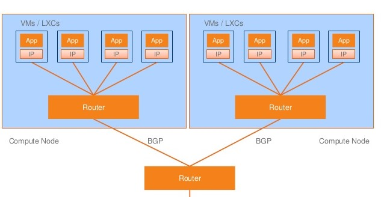

# Calico - Policy-driven network security

## Basics

### Kubernetes
Kubernetes defines `NetworkPolicies` as a distinct resource. A `NetworkPolicy` is a specification of how groups of pods are allowed to communicate with each other and other network endpoints. However, Kubernetes does not manage nor enforce these `NetworkPolicies`. This is implemented by the network plugin/solution. There are many different network solution, including Calico (which is already installed by Gardener into every cluster).

Sources: 
- https://kubernetes.io/docs/concepts/services-networking/network-policies/
- https://kubernetes.io/docs/concepts/cluster-administration/networking/

### Calico
Project Calico is a network solution for Kubernetes. Calico configures a layer 3 network that uses the BGP routing protocol to route packets between hosts. This means that packets do not need to be wrapped in an extra layer of encapsulation when moving between hosts. The BGP routing mechanism can direct packets natively without an extra step of wrapping traffic in an additional layer of traffic.

Besides the performance that this offers, one side effect of this is that it allows for more conventional troubleshooting when network problems arise.

Sources: 
- https://www.projectcalico.org/
- https://rancher.com/blog/2019/2019-03-21-comparing-kubernetes-cni-providers-flannel-calico-canal-and-weave/
- https://www.slideshare.net/packethost/intro-to-project-calico-a-pure-layer-3-approach-to-scaleout-networking

### NetworkPolicy and GlobalNetworkPolicy
Calico distinguished between `NetworkPolicies` and `GlobalNetworkPolicies`.

Both are resources that represent an ordered set of rules which are applied to a collection of endpoints that match a label selector.

A `NetworkPolicy`is only defined for a single namespace. It only applies to workload endpoint resources in that namespace. In contrast, a `GlobalNetworkPolicy`is not a namespaced resource. A `GlobalNetworkPolicy` applies to workload endpoint resources in all namespaces, and to host endpoint resources. 

Sources:
- https://docs.projectcalico.org/v3.9/reference/resources/networkpolicy
- https://docs.projectcalico.org/v3.9/reference/resources/globalnetworkpolicy

## Installation
As Gardener already installs Calico into every cluster, there is not much to do.

On the one hand, you can create a `NetworkPolicy` policy using `kubectly` and a `GlobalNetworkPolicy` (as well as other Calico-specific resources) using `calicoctl`.

Source: https://docs.projectcalico.org/v3.9/getting-started/calicoctl/install

### Demo
For testing Calico, we want to achieve the following setup:
- ...

Let us start:

## Implementation Idea
Implementing Calico-based host-security policies into karydia needs the following steps:
1. Create a service account with sufficient permission for creating the defined policies
2. Run a pod with `calicoctl` that applies the policies and other calico-specific resources
3. Kill the pod after it is finished
4. Remove all calico-related resources created by karydia if karydia is deleted
