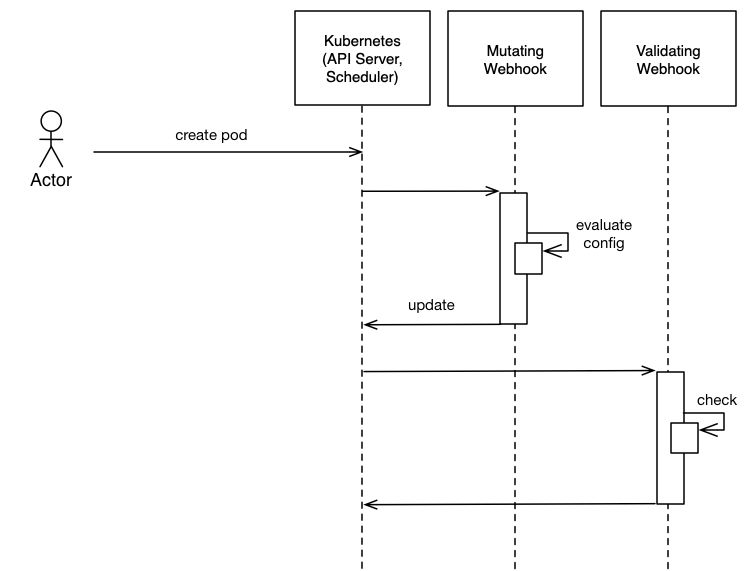

# karydia Concepts
## Secure by Default
The mission of karydia is to configure kubernetes in a more secure way. Many kubernetes default settings are unsecure. When karydia is installed these defaults are revised and supervised. Most karydia features can be switched on centrally and configured on namespace level.  

## Configuration
karydia provides the possibility to select the security features which should be used and supervised in a kubernetes cluster (deployment.yml). More specific settings can be made in a [KarydiaSecurityPolicy](/manifests/../../example-karydia-security-policy.yml). If these settings shall be adapted for a selected namespace it is possible to overwrite it with an annotation.

The network policy configuration deviates from this blueprint. It combines its configuration in separate files. There are several options of default network policies with different security levels. The default can be specified in a karydia ConfigMap which must be deployed before installation [Deploy Karydia](https://github.com/karydia/karydia/blob/master/docs/install.md).

## Installation
When karydia is installed it will spin up a karydia webhook and a karydia policy controller. The karydia policy controller will determine the difference between the current state and the configuration. If there are discrepancies karydia will level out it. That means for example if the network policy feature is enabled karydia will create a network policy for each relevant namespace. 

### Post Installation
After installation karydia will create the selected default network policy in all existing namespaces. It is possible to provide a list with namespaces that should be excluded (default: kube-system) The creation of network policies is the only executed post-installation step. All other feature will only be available for objects that are created or modified after the karydia installation. This means if a pod is created after the installation of karydia the service account token will not be available. If it would have been created before karydia was installed the token had been mounted and it will be still available. 

After installation karydia will not: 
* add seccomp profiles to existing pods
* unmount service account tokens

## Operations
### Webhook
karydia implements a webhook to influence security settings. This means if a pod is created or modified without a "seccomp", "service account token", ... annotation the webhook will add a corresponding annotation with the defaults from the active KarydiaSecurityPolicy. 

### Controller
The karydia policy controller will checks regularly for new or modified artifacts (e.g. namespaces). If there are relevant changes, karydia will add corresponding security settings. This means for example: If a namespace is created karydia will create a default network policy for the new namespace.

## Reconcile
karydia security settings can be disabled by an administrator. The karydia reconciling should guarantee that any activated security setting is forced, even so it is deleted manually. This means if an administrator deletes a karydia network policy it will be recreated by karydias reconciler.

There will be no reconciliation of:
* service account token
* seccomp

