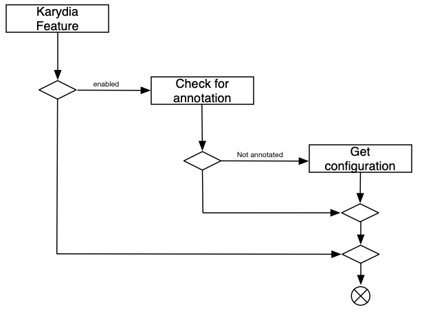

# karydia Concepts
## Secure by Default
The mission of karydia is to configure kubernetes in a more secure way. Many kubernetes default settings are unsecure. When karydia is installed these defaults are revised and supervised. Most karydia features can be switched on centrally and configured on namespace level.  

## Configuration
karydia provides the possibility to select the security features which should be used and supervised in a kubernetes cluster (deployment.yml). More specific settings can be made in a KarydiaSecurityPolicy (example-karydia-security-policy.yml). If these settings shall be adapted for a selected namespace it is possible to overwrite it with an annotation.

## Installation
When karydia is installed it will spin up a karydia webhook and a karydia policy controller. The karydia policy controller will determine the difference between the current state and the configuration. If there are discrepancies karydia will level out it. That means for example if the network policy feature is enabled karydia will create a network policy for each relevant namespace. 

## Operations
### Webhook
karydia implements a webhook to influence security settings. This means for example: If a new pod is created without a seccomp annotation the webhook will add the karydia default seccomp policy.

### Controller
The karydia policy controller will checks regularly for new or modified artifacts (e.g. namespaces). If there are relevant changes, karydia will add corresponding security settings. This means for example: If a namespace is created karydia will create a default network policy for the new namespace.

## Reconcile
Many karydia security settings can be disabled by an administrator. The karydia reconciling should guarantee that any activated security setting is forced, even so it is deleted manually. This means if an administrator deletes a karydia network policy it will be recreated by the karydias reconciler.

